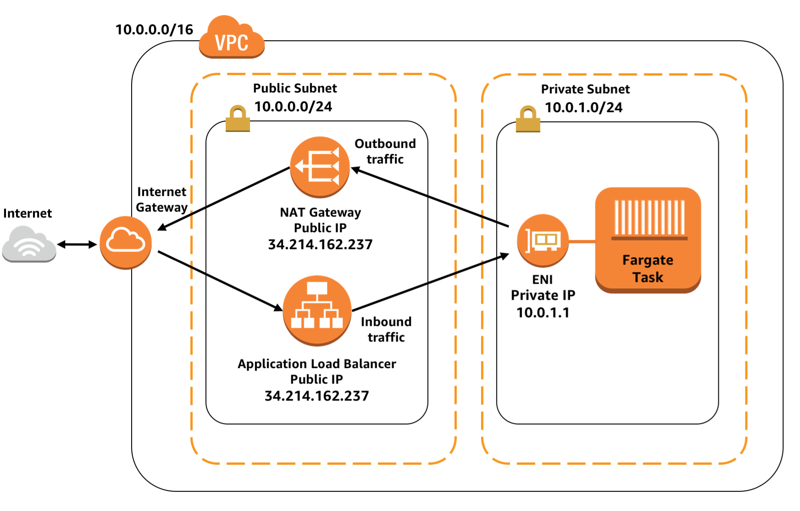

# Tui

Tui-app is a Spring Boot App for recruitment process.

## Installation

```bash
./mvn spring-boot:run
```

Example building from Dockerfile

```bash
docker build -t tui-demo:1.0 .
docker run -p 8080:8080 ${imageId}
```

## Usage

http://test-loadbalancer-878108206.us-east-1.elb.amazonaws.com/swagger-ui/index.html

## Real world vs. example

* In real world API should limit requests (for example, to prevent DDoS attacks).
* In real world in profiles should be defined.
* In real world, depending on requirements, some circuit breaker solution may be necessary.
* In real world, depending on requirements, pagination and sorting endpoint may be necessary.
* In real world, depending on requirements, authorization may be necessary to increase available request pool.

## Technologies

* Java 1.15
* Spring Boot 2.3.7

## AWS



## CI/CD

* Used CodePipeline
* Deploy provider is Amazon ECS
* Integrated with https://github.com/adampoplawski/tui-demo

## License

[MIT](https://choosealicense.com/licenses/mit/)